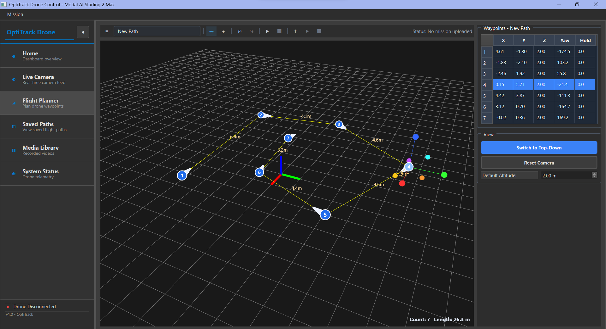
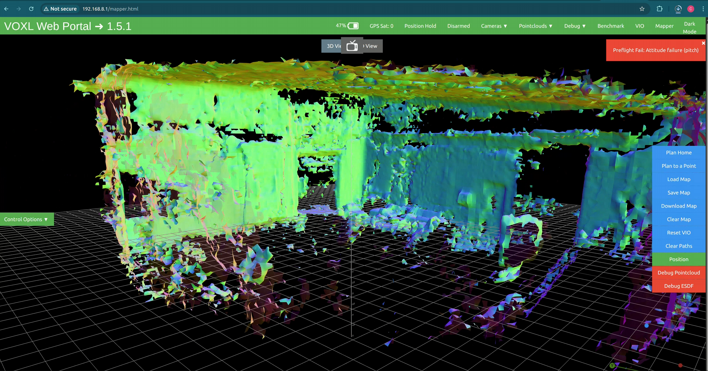

# Drone-Based Volume Calibration for OptiTrack

**Automated drone-based calibration for large OptiTrack camera volumes.**

## Project Description

This project gives OptiTrack operators a way to calibrate large camera volumes — sports fields, multi-story buildings, and other spaces too big or too tall for a person to wand by hand — by sending a drone through the space instead.

Manual calibration of a large volume is slow, hard to reproduce, and sometimes physically impossible. Walking a calibration wand across a 100-meter field or up several stories of scaffolding is exhausting at best and unsafe at worst, and any inconsistency in coverage shows up as worse tracking accuracy.

By having a drone fly a defined trajectory while carrying a calibration rod, the same volume can be calibrated repeatably, with full coverage, without putting a person in the space. The flight path can be saved and re-flown the next time the volume needs to be re-checked.

## Key Features

- **Qt-based waypoint editor.** Operators sketch and edit the drone's flight path through the volume in a desktop UI — no scripting, no flight-controller knowledge required.
- **Record and replay calibration runs.** Once a trajectory works for a given room or field, it can be saved and re-flown on demand whenever the volume needs to be re-calibrated.
- **Calibration-rod handling with Motive integration.** The drone carries the calibration rod through the volume and coordinates start/stop with OptiTrack Motive, so calibration data lands in the same workflow operators already use.
- **Onboard SLAM mapping.** The drone builds a live map of the space as it flies, so operators can see the volume the drone has covered and confirm the calibration trajectory matches the real environment.

_Figure 1 — The Qt waypoint editor: operators place and edit waypoints to define the drone's calibration trajectory._

_Figure 2 — Live SLAM map produced by the drone as it flies, showing the volume covered during a calibration run._

<model-viewer
  src="https://e5zbuejfkyw0alvi.public.blob.vercel-storage.com/drone5.gltf"
  alt="Interactive 3D model of the calibration drone used in this project"
  camera-controls
  auto-rotate
  camera-orbit="0deg 75deg auto"
  shadow-intensity="1"
  style="width: 100%; height: 500px;">
  Interactive 3D model of the calibration drone — view at the GitHub Pages site to rotate and inspect.
</model-viewer>

_Figure 3 — Interactive 3D model of the calibration drone (drag to rotate; scroll to zoom). Visible on the GitHub Pages version of this README._

## How to Access or Try It

This is a research and development project; there is no installable build yet. To see how it works:

- **[View the source on GitHub](https://github.com/OptiTrack/Drone)** — browse the Qt UI (`qt-drone-ui/`) and the on-drone programs (`voxl-programs/`).

**System requirements:**

- OptiTrack Motive (for the camera volume being calibrated)
- A VOXL-based drone (the on-drone software lives in `voxl-programs/`)
- Qt, to run the desktop control UI

## Team

This is an Oregon State University capstone project, developed in collaboration with NaturalPoint Inc. DBA OptiTrack.

- Cohen Velazquez — velazquc@oregonstate.edu
- Parthiv Nair — nairp@oregonstate.edu
- Bryan Chen — chenbry@oregonstate.edu
- Andrew Nolke — nolkea@oregonstate.edu

For questions or feedback, email any of the team members above.

## License

All non-third-party code in this repository is jointly owned by the team listed above and NaturalPoint Inc. DBA OptiTrack. See `LICENSE.txt` in the [`licenses/`](licenses) folder for full terms; third-party licenses are in the same folder, named accordingly.
