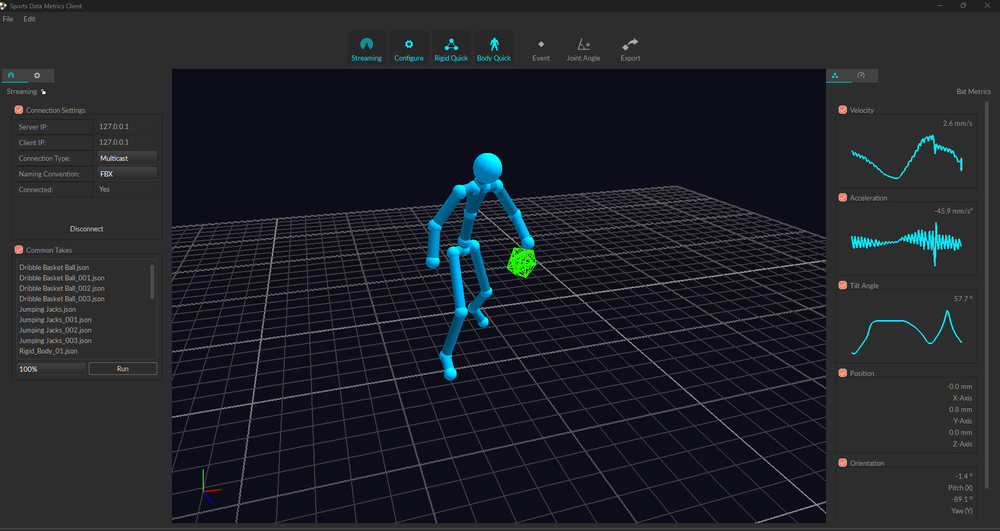
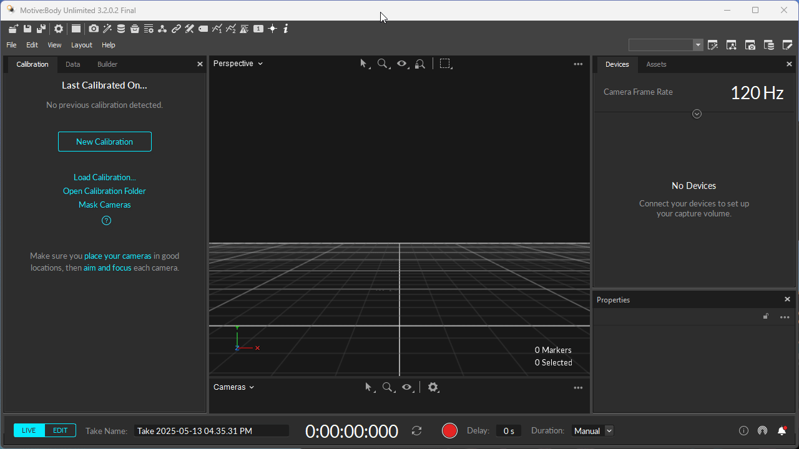
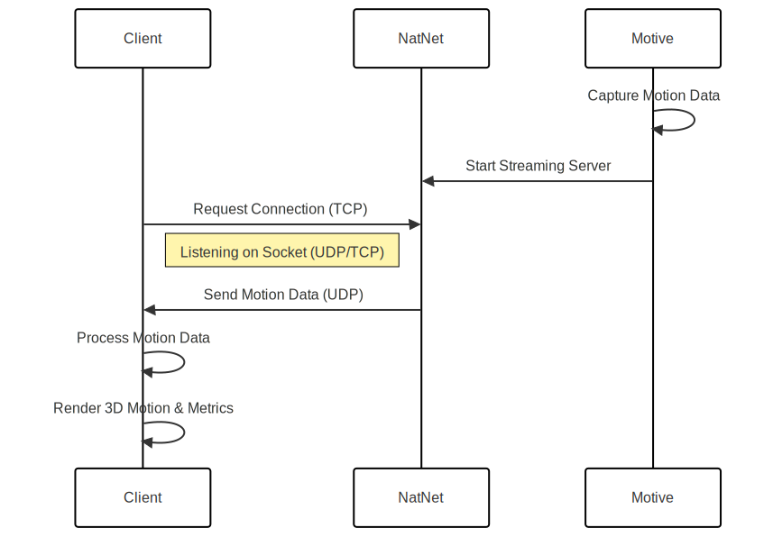

[](https://github.com/your-org/your-repo)


# Sports Data Metric Client



## Table of Contents

- [🧩 Technologies](#-technologies)
- [🛠️ Setup](#-setup)
  - [📦 Install Dependencies](#-install-dependencies)
  - [⚙️ Environment Setup](#-environment-setup)
- [🔍 Usage](#-usage)
  - [🚀 Start Up](#-start-up)
- [📊 UML Sequence Diagram](#-uml-sequence-diagram)
- [📝 License](#-license)

## 🧩 Technologies


## 🛠️ Setup

[🔝 Table of Contents](#table-of-contents)

### 📦 Install Dependencies

<div style="margin-left: 30px;">

<details>
<summary>Install Motive</summary>

- [Download Motive](https://www.optitrack.com/support/downloads/motive.html)
- *NOTE: If you do not have a Motive license, the program will also read from 
some recorded common takes. The common takes are captured files from the Optitrack
dataset*

</details>

<details>
<summary>Install Qt 6 (MSVC 2022 64-bit)</summary>

1. Download and install Qt from [https://www.qt.io/download-open-source](https://www.qt.io/download-open-source).  
2. In the Qt Maintenance Tool, ensure you have “MSVC 2022 64-bit” components installed.

</details>

<details>
<summary>Install 2022 MSVC Compiler & Debugger</summary>

- [Download Visual Studio](https://visualstudio.microsoft.com/vs/)
- [Download Build Tools](https://visualstudio.microsoft.com/downloads/#build-tools-for-visual-studio-2022)

</details>

</div>

### ⚙️ Environment Setup

<div style="margin-left: 30px;">

<details>
<summary>Set up Qt & MSVC integration</summary>

1. Open the **Qt Maintenance Tool** and verify “MSVC 2022 64-bit” is installed under your Qt version (e.g., 6.x).  
2. Open a **“x64 Native Tools Command Prompt for VS 2022”** to have MSVC in your `PATH`.  

</details>

<details>
<summary>Clone rep</summary>

1. Clone repo to your local machine.  

</details>

</div>

## 🔍 Usage

[🔝 Table of Contents](#table-of-contents)

### 🚀 Start Up

<div style="margin-left: 30px;">

<details>
<summary>Start Motive</summary>

1. Launch Motive
2. Navigate to Settings and verify NatNet streaming is enabled under the "Streaming" tab
3. Open pre-recorded motion capture file or navigate to the sample motion capture file underneath the "Data" tab
4. Load a "Common Take"
5. Update the take display settings to use either loop, bounce, or endpoint
6. Ensure the reverse button is unhighlighted (frames will stream in chronological order)
7. Select a playback speed (note: playback speed will affect the client's performance and faster speeds should only be used with high-performance system specifications)
8. Select the number of frames to stream to metrics client (defaulted to all frames)
9. Once the Sports Metric Data Client is running, frames could be streamed continuously or frame-by-frame with the play buttons


</details>

<details>
<summary>Start Sports Data Metrics</summary>

1. Go to the debug.bat file.
2. Update user configuration to point at the correct directories for your environment.
3. In a terminal in the root directory, run ```./debug.bat```
4. The program will compile and start automatically. 

</details>

</div>

## 📊 UML Sequence Diagram

[🔝 Table of Contents](#table-of-contents)



## 📝 License

[🔝 Table of Contents](#table-of-contents)

This project is licensed under a [Open-Source License](./LICENSE).
